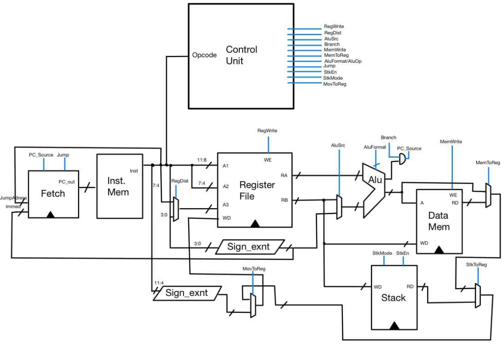

# ASR 17 bits CPU
## 17 bits ISA Amateur RISC Sample CPU implementation on FPGA

### Contributors 
    @MinhaTu  Ailson Alexandre Da Silva Morais
    @-------  Sandra Ayumi
    @-------  Rodrigo Kappes

### Check the formal presentation (french only) in the link below
[Presentation link](https://centralesupelec-my.sharepoint.com/:f:/g/personal/ailson_morais_student-cs_fr/Emygj4c3wYZIkdcLtzaXXmEBsK_Y-_uDHsIJTqzVPmdvQg?e=v7OoTj). 

### Description 
This projects aims to build a simple Single-cycle processor based on the MIPS architecture for basic functions. Using a homemade ISA composed of 17 bits, it's designed to respect the following specifications:
    -Perform arithmetic and logic operations on registers;
    -Allow the realization of loops and jumps;
    -Allow conditions.
    
### Main components of the circuitry
    -Control unit;
    -ROM;
    -RAM;
    -Stack;
    -Register File;
    -ALU;
    -Mutex;
    -Sign_extend modules.
    
### Main circuit scheme

